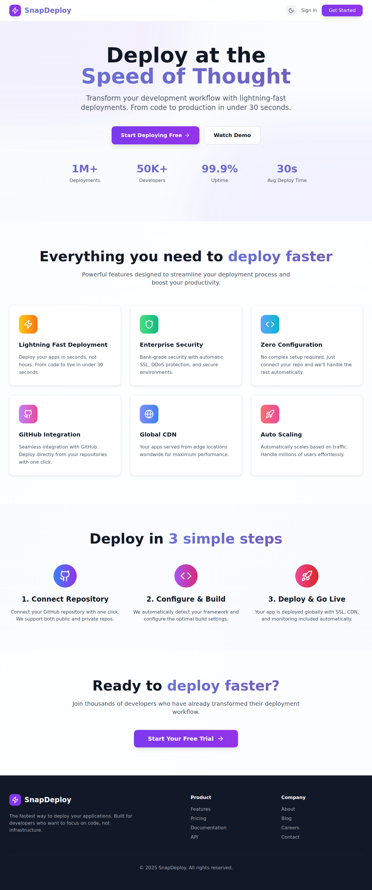

# SnapDeploy 🚀

SnapDeploy is a modern, automated web application deployment platform that allows developers to deploy their GitHub repositories to the cloud with just a few clicks. Think of it as a simplified version of Vercel or Netlify, built with a microservices architecture.



> **Live Demo**: Experience SnapDeploy's lightning-fast deployments at [snapdeploy.me](https://snapdeploy.me)

## 🌟 Key Features

- **🔗 GitHub Integration**: Connect your GitHub account and deploy repositories directly
- **⚡ Instant Deployment**: Deploy your applications in seconds with automated build pipelines
- **🌐 Custom Subdomains**: Each project gets a unique subdomain (e.g., `your-project.snapdeploy.me`)
- **🔒 Private Repository Support**: Deploy both public and private GitHub repositories
- **📊 Real-time Logs**: Monitor your deployment progress with live build logs
- **🔧 Environment Variables**: Configure custom environment variables for your projects
- **🌙 Dark/Light Theme**: Modern UI with theme switching support
- **📱 Responsive Design**: Works seamlessly on desktop and mobile devices

## 🏗️ Architecture Overview

SnapDeploy consists of four main microservices:

### 1. Frontend (`/frontend`)
- **Technology**: React 18 + Vite + Tailwind CSS
- **Purpose**: User interface for project management and deployment
- **Features**: 
  - Project creation and management
  - GitHub repository selection
  - Real-time deployment monitoring
  - User authentication and profile management

### 2. API Server (`/api-server`)
- **Technology**: Node.js + Express + MongoDB
- **Purpose**: Backend API handling authentication, project management, and deployments
- **Key Features**:
  - JWT-based authentication
  - GitHub OAuth integration
  - Project CRUD operations
  - Deployment orchestration
  - Real-time log streaming

### 3. Build Server (`/build_server`)
- **Technology**: Docker + Node.js + AWS ECS
- **Purpose**: Automated build and deployment pipeline
- **Process**:
  1. Clones repository from GitHub
  2. Installs dependencies (`npm install`)
  3. Builds the project (`npm run build`)
  4. Uploads build artifacts to AWS S3
  5. Streams logs back to the API server

### 4. S3 Reverse Proxy (`/s3-reverse-proxy`)
- **Technology**: Node.js + Express + HTTP Proxy
- **Purpose**: Routes subdomain requests to appropriate S3-hosted sites
- **Features**:
  - Subdomain-based routing
  - Project lookup caching
  - Proxy to S3 static hosting

## 🔧 Technology Stack

### Backend
- **Runtime**: Node.js
- **Framework**: Express.js
- **Database**: MongoDB with Mongoose ODM
- **Authentication**: JWT + GitHub OAuth
- **Cloud**: AWS (ECS, S3, VPC)
- **Message Queue**: Kafka
- **Validation**: Zod

### Frontend
- **Framework**: React 18
- **Build Tool**: Vite
- **Styling**: Tailwind CSS
- **Routing**: React Router DOM
- **HTTP Client**: Axios
- **Icons**: Lucide React
- **Notifications**: React Hot Toast

### DevOps & Infrastructure
- **Containerization**: Docker
- **Orchestration**: AWS ECS (Fargate)
- **Storage**: AWS S3
- **Proxy**: Custom Node.js reverse proxy
- **CI/CD**: Automated via ECS tasks

## 🚀 How It Works

### Deployment Flow

1. **User Authentication**
   - User signs up/logs in to SnapDeploy
   - Connects GitHub account via OAuth

2. **Project Creation**
   - User selects a GitHub repository
   - Configures project settings (name, branch, environment variables)
   - Generates unique subdomain

3. **Build Process**
   - API server triggers ECS task
   - Build container clones the repository
   - Installs dependencies and builds the project
   - Uploads build artifacts to S3

4. **Deployment**
   - S3 reverse proxy routes subdomain traffic
   - Project becomes accessible at `subdomain.domain.com`
   - Real-time logs stream to the frontend

### Data Models

#### Project
```javascript
{
  name: String,
  gitURL: String,
  subdomain: String,
  owner: ObjectId, // User reference
  frontendPath: String,
  envVariables: Map,
  githubBranch: String,
  isPrivateRepo: Boolean,
  deployments: [ObjectId] // Deployment references
}
```

#### Deployment
```javascript
{
  projectId: ObjectId,
  status: String, // QUEUED, IN_PROGRESS, SUCCESS, FAILED
  createdAt: Date,
  completedAt: Date,
  logs: [String]
}
```

#### User
```javascript
{
  username: String,
  email: String,
  githubId: String,
  githubUsername: String,
  githubAccessToken: String, // Encrypted
  isGithubConnected: Boolean,
  profilePhoto: String
}
```

## 🛠️ Setup & Installation

### Prerequisites
- Node.js 18+
- MongoDB
- AWS Account with ECS, S3 access
- GitHub OAuth App
- Kafka instance (optional, for real-time features)

### Environment Variables

Create `.env` files in each service directory:

#### API Server (`/api-server/.env`)
```env
PORT=8000
MONGODB_URI=mongodb://localhost:27017/snapdeploy
JWT_SECRET=your-jwt-secret
ACCESS_TOKEN_SECRET=your-access-token-secret
REFRESH_TOKEN_SECRET=your-refresh-token-secret

# GitHub OAuth
GITHUB_CLIENT_ID=your-github-client-id
GITHUB_CLIENT_SECRET=your-github-client-secret

# AWS Configuration
AWS_REGION=ap-south-1
AWS_ACCESS_KEY_ID=your-aws-access-key
AWS_SECRET_ACCESS_KEY=your-aws-secret-key
ECS_CLUSTER_NAME=your-ecs-cluster
ECS_TASK_DEFINITION=your-task-definition

# Encryption
ENCRYPTION_KEY=your-32-character-encryption-key
```

#### Frontend (`/frontend/.env`)
```env
VITE_API_BASE_URL=http://localhost:8000
VITE_REVERSE_PROXY_URL=your-domain.com
```

#### Build Server (`/build_server/.env`)
```env
AWS_ACCESS_KEY_ID=your-aws-access-key
AWS_SECRET_ACCESS_KEY=your-aws-secret-key
AWS_BUCKET_NAME=your-s3-bucket
KAFKA_BROKER=your-kafka-broker
KAFKA_USERNAME=your-kafka-username
KAFKA_PASSWORD=your-kafka-password
```

### Installation Steps

1. **Clone the repository**
   ```bash
   git clone https://github.com/Pavan0228/SnapDeploy.git
   cd SnapDeploy
   ```

2. **Install API Server dependencies**
   ```bash
   cd api-server
   npm install
   ```

3. **Install Frontend dependencies**
   ```bash
   cd ../frontend
   npm install
   ```

4. **Install Build Server dependencies**
   ```bash
   cd ../build_server
   npm install
   ```

5. **Install S3 Reverse Proxy dependencies**
   ```bash
   cd ../s3-reverse-proxy
   npm install
   ```

6. **Set up MongoDB**
   - Install and start MongoDB
   - Create a database named `snapdeploy`

7. **Configure AWS**
   - Set up ECS cluster
   - Create S3 bucket for hosting
   - Configure VPC and security groups

8. **Build Docker image for Build Server**
   ```bash
   cd build_server
   docker build -t snapdeploy-builder .
   ```

### Running the Application

1. **Start API Server**
   ```bash
   cd api-server
   npm run dev
   ```

2. **Start Frontend**
   ```bash
   cd frontend
   npm run dev
   ```

3. **Start S3 Reverse Proxy**
   ```bash
   cd s3-reverse-proxy
   npm start
   ```

The application will be available at:
- Frontend: `http://localhost:5173`
- API Server: `http://localhost:8000`
- Reverse Proxy: `http://localhost:8000` (configured port)

## 📊 API Endpoints

### Authentication
- `POST /auth/register` - User registration
- `POST /auth/login` - User login
- `POST /auth/logout` - User logout
- `GET /auth/me` - Get current user

### GitHub Integration
- `POST /github/connect` - Connect GitHub account
- `GET /github/repositories` - Get user's repositories
- `GET /github/repositories/:owner/:repo/branches` - Get repository branches
- `POST /github/disconnect` - Disconnect GitHub account

### Projects
- `POST /projects` - Create new project
- `GET /projects` - Get user's projects
- `GET /projects/:id` - Get project details
- `PUT /projects/:id` - Update project
- `DELETE /projects/:id` - Delete project

### Deployments
- `POST /deployments` - Create new deployment
- `GET /deployments/:id/status` - Get deployment status
- `GET /logs/:deploymentId` - Get deployment logs (SSE)

## 🔒 Security Features

- **JWT Authentication**: Secure token-based authentication
- **Encrypted Tokens**: GitHub access tokens are encrypted before storage
- **CORS Configuration**: Proper CORS setup for cross-origin requests
- **Input Validation**: Zod schema validation for all API inputs
- **Private Repository Support**: Secure handling of private GitHub repositories

## 🎯 Use Cases

- **Personal Projects**: Deploy your side projects and portfolios
- **Prototyping**: Quickly deploy prototypes for testing and demos
- **Static Sites**: Deploy React, Vue, Angular, or vanilla HTML/CSS/JS sites
- **Documentation**: Deploy documentation sites built with tools like Docusaurus
- **Landing Pages**: Create and deploy marketing landing pages

## 🔮 Future Enhancements

- [ ] Custom domain support
- [ ] Automatic SSL certificate management
- [ ] Build caching for faster deployments
- [ ] Team collaboration features
- [ ] Deployment rollback functionality
- [ ] Integration with more Git providers (GitLab, Bitbucket)
- [ ] Advanced analytics and monitoring
- [ ] CI/CD webhook integration

## 🤝 Contributing

1. Fork the repository
2. Create a feature branch (`git checkout -b feature/amazing-feature`)
3. Commit your changes (`git commit -m 'Add some amazing feature'`)
4. Push to the branch (`git push origin feature/amazing-feature`)
5. Open a Pull Request

## 📄 License

This project is licensed under the ISC License. See the `LICENSE` file for details.

## 👥 Team

- **Pavan** - [@Pavan0228](https://github.com/Pavan0228)

## 🙏 Acknowledgments

- Thanks to the open-source community for the amazing tools and libraries
- Inspired by platforms like Vercel, Netlify, and Railway
- Built with ❤️ for developers who want to deploy fast

---

**⭐ Star this repository if you find it helpful!**
